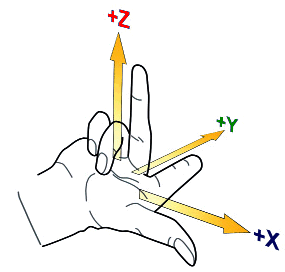

## Right-hand rules

In order to be able to specify a point in space, one needs the z-coordinate in addition to the x- and y-coordinate. 
The corresponding z-axis is perpendicular to both the x-axis and the y-axis.

The right-hand rule is needed to infer the directions of the axes and the order of the axes x, y and z - and this is how the rule works:
Spread the first three fingers of your right hand as shown above in the picture. 
By virtue of the right-hand rule, your thumb becomes the positive x-axis, the index finger sticking out at right angles to the thumb becomes the positive y-axis, and the middle finger becomes the z-axis. The position of the middle finger is of crucial importance. It points in the positive z-direction. 
No matter how you now twist your right hand with the spread fingers, the positive direction of the z-axis is always clearly determined by the right-hand rule. 

