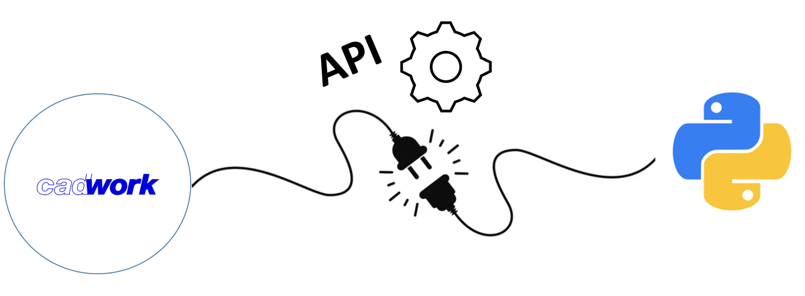

# CWMATH

Cwmath is an open source project in which Python functions are developed and made available by the community, for the community. 

## Agreement

By contributing code to this repo, you automatically agree that cadwork owns and may distribute the code.

