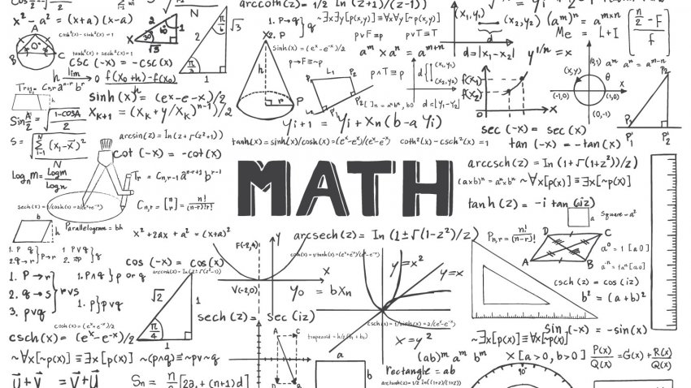

# Cadwork Math Utilities

`cwmath` is a small, dependency-free geometry library for cadwork 3d plugin
authors. Frozen `Point` / `Vec` types in 2D and 3D, a right-handed `Frame3`,
`Plane3`, `Line3`, and projections of a point onto a line or a plane.

Import the public types from the package root:

```python
from cwmath import Point3, Vec3, Frame3, Plane3, Line3, to_point_3d
```

[Cadwork Python Documentation](https://docs.cadwork.com/projects/cwapi3dpython/en/latest/){.button-63}

## Types

- [Point3](point3.md) / [Vec3](vec3.md) — 3D affine pair, convertible to `cadwork.point_3d`
- [Point2](point2.md) / [Vec2](vec2.md) — 2D affine pair
- [Frame3](frame3.md) — local ↔ world for points and vectors
- [Plane3](plane3.md) / [Line3](line3.md) — reference plane and infinite line
- [Functions](functions.md) — `to_point_3d`, projections, `is_close`

Cadwork millimetres are the implicit length unit. `==` is exact IEEE equality;
use `is_close` when you want a tolerance.

## Host conversion

`Point3.from_xyz` / `Vec3.from_xyz` accept anything with `.x`, `.y`, `.z`
(including `cadwork.point_3d`). `to_point_3d` imports `cadwork` only at the
call site so CI can run without the host. Smoke-test the real adapter once in
cadwork IDLE:

```python
from cwmath import Point3, to_point_3d

to_point_3d(Point3(1, 2, 3))  # a real cadwork.point_3d
```



## Agreement

By contributing code to this repo you agree that cadwork may distribute the code.

## Guidelines

We have few [guidelines](style_guide.md#Coding-Guidelines), so please follow the coding styles we provide. :wink:
